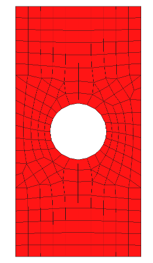

# About
This repository contains all the source code and a complete example problem to perform inverse material characterization from digital image correlation (DIC) data.  The process makes use of Nastran (in this example, I will be using Genesis for the FE analysis which is Nastran IO compatible) to perform the FE analyses and DOT (Design Optimization Tools from [VR&D](http://www.vrand.com)) as the optimizer.  DOT provides a library of gradient-based optimization algorithms.

# Information
This project was setup to work for both Windows and Linux environments although it was only tested in a Linux environment.  Minor tweaks may thus be required to make this work on Windows.  The DOT optimization library is required and a few environment variables should be set when using the Python wrapper for DOT.  It is best to look at the following repository [DOTWrapper](https://github.com/MODRG/DOTWrapper) for getting up and running with DOT if you are not already familiar with the software.

# Requirements
- The DOT optimizer (commercial code form [VR&D](http://www.vrand.com)).  A Python wrapper for DOT is provided in this repository that will allow the user to call the DOT shared library from within Python.  Because DOT is a commercial optimizer, a license is required to use it.
- Genesis (or Nastran) to perform the FE analyses
- [NumPy](http://www.numpy.org/) Numerical Python library
- [pyNastran](https://pynastran-git.readthedocs.io/en/latest/) Python interface to Nastran IO files
- [Pandas](https://pandas.pydata.org/) Python data analysis library
- [StatsModels](https://www.statsmodels.org/stable/index.html) Statistical package used for linear regression
- [scipy.interpolate](https://docs.scipy.org/doc/scipy/reference/interpolate.html) Sub-package for objects used in interpolation
- [MatPlotLib](https://matplotlib.org/) Python 2D plotting library


# File description
| File        | Description  |
| ----------- |------------- |
| [dot.py](https://github.com/MODRG/InverseMatNastran/blob/master/dot.py)  | The Python wrapper for DOT |
| [analysis.py](https://github.com/MODRG/InverseMatNastran/blob/master/analysis.py) | The file containing all the logic for interfacing DOT with Genesis |
| [optimization.py](https://github.com/MODRG/InverseMatNastran/blob/master/optimization.py) | The main program that calls analysis.py for performing the inverse material matching |
| [platewithhole_FEM.dat](https://github.com/MODRG/InverseMatNastran/blob/master/platewithhole_FEM.dat) | The Genesis input file for the FE representation of the test |
| [exp_data.dat](https://github.com/MODRG/InverseMatNastran/blob/master/exp_data.dat) | The DIC displacement data for the test|

# Example problem
The example problem considered here is to obtain the linear, isotropic material properties (E and G) for a sample that consists of a plate with a hole as shown below.



The sample is subjected to a simple tensile test and the full displacement field is measured with DIC.  In this particular case, the DIC data is obtained from a second FE model with a finer mesh.  In this case, the exact material properties are thus known as:

| Description | Value |
| ----------- | ----- |
| E           | 68.98 GPa |
| G           | 25.93 GPa      |
| Poison's Ratio | 0.33 |


Note that the optimization is performed in terms of E and G instead of E and the Poison's ratio.  This makes life a bit easier for the optimizer since both variables have roughly the same order of magnitude.

# Getting started
Before running the code, please make sure that you have both Genesis and DOT installed and working on your computer.  With little effort, you should be able to change the code to work with Nastran instead of Genesis.  Both Genesis and DOT are commercial software and you will need a license to run them.

1. Set the VRAND_AUT environment variable to point to the VR&D license file (the same file is used for both Genesis and DOT) and the LD_LIBRARY_PATH environment variable to point to the location of your DOT shared library.  For example, on Linux:
```
export VRAND_AUT=/opt/vrand/licenses/vrand.lic
export LD_LIBRARY_PATH=/opt/vrand/dot6.0
```
On Windows, you need to define a new environment variable for VRAND_AUT and add the path to your DOT shared library (.dll) to your current PATH environment variable.  It is a good idea to add this to the end of your current PATH environment variable.
2. Clone this library (command line command for Linux are provided below)
```
git clone https://github.com/MODRG/InverseMatNastran.git
```
3. Change to the InverseMatNastran folder
```
cd InverseMatNastran
```
4. Make sure the following variables at the top of the analsyis.py file are set correctly for your environment
```
GENESIS   = '/opt/vrand/bin/genesis'
ZIP       = '/usr/bin/gzip'
ZIP_FLAGS = ['-f', '-d']
```
5. Run the example
```
python optimization.py
```

# Authors
- Gerhard Venter - First publication 30 August 2019
